# MySport App

## Description
----------------
Aplikasi pada platform android ini merupakan aplikasi penunjang workout.
Pada aplikasi ini kita dapat melihat berita seputar olahraga dan mentrack kegiatan olahraga kita yaitu berlari dan bermain sepeda.

## Procedure & Specification
### Sports News
----------------
- Penggguna dapat melihat halaman list berita olahraga dengan sumber berita adalah https://www.google.com/url?q=https://newsapi.org/s/indonesia-sports-news-api&sa=D&source=editors&ust=1619802393505000&usg=AOvVaw3edVsHqPpHqgcA2L6su17S
- Ketika pengguna memilih salah satu list, aplikasi akan menampilkan WebView dengan konten sesuai dengan list yang dipilih

#### Documentation

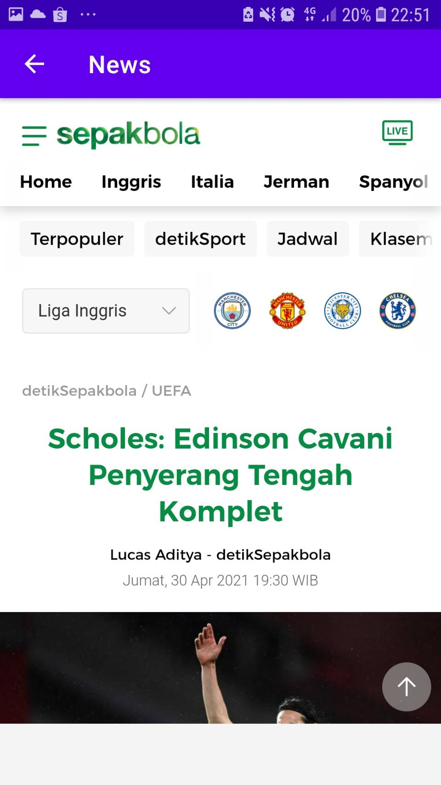

### Training Tracker
----------------
- Pengguna dapat mencatat dengan melacak latihan yang di lakukan (start & finish)
- Latihan terdiri atas 2 jenis, yaitu Cycling dan Walking
- Sebelum memilih jenis latihan, aplikasi menampilkan kompas disertai pilihan jenis latihan
- Cycling, melacak rute melalui GPS. Hasil berupa jarak tempuh dan garis rute
- Running, melacak jumlah langkah
- Sistem pelacakan berjalan di background

#### Documentation
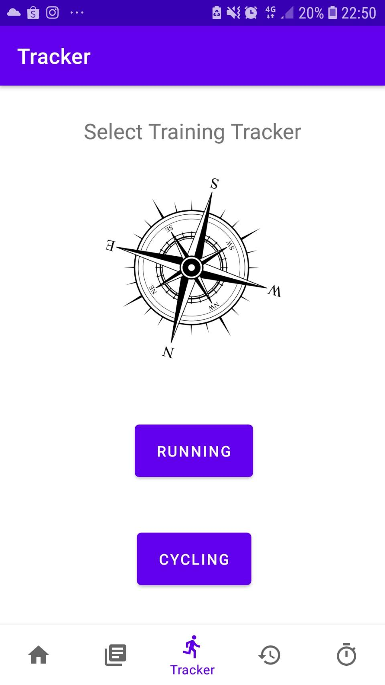
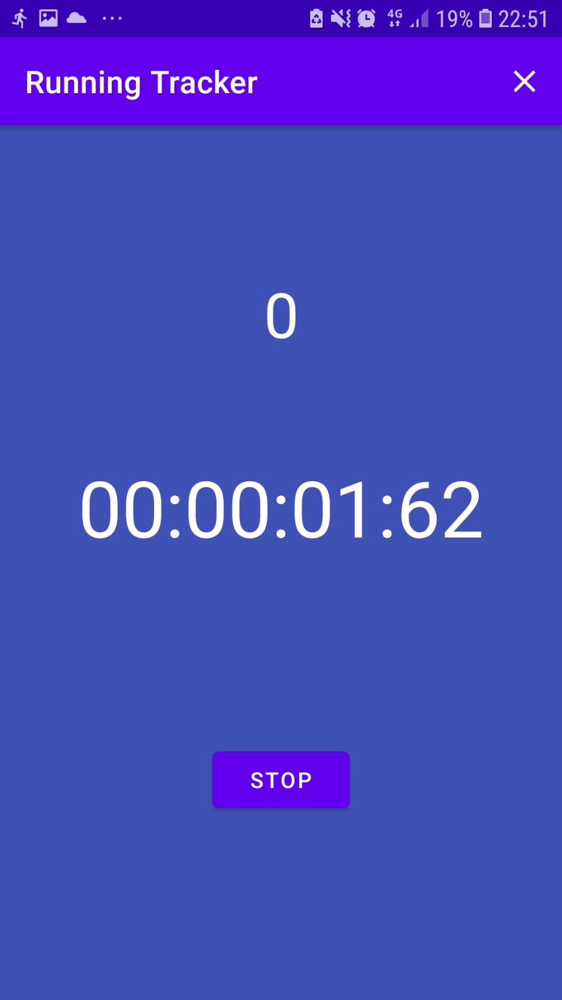
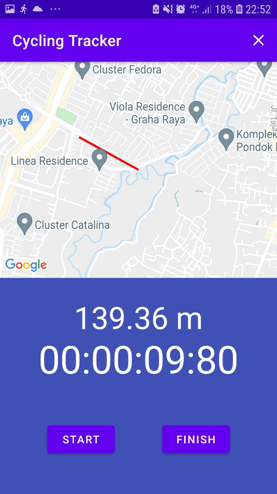

### Training History
- Menampilkan kalender yang jika dipilih suatu tanggal akan menampilkan history latihan ditanggal tersebut
- List log history pada tanggal tersebut ditampilkan dalam bentuk list
- Jika list dipilih, maka akan menampilkan informasi detail latihan yang dipilih

#### Documentation
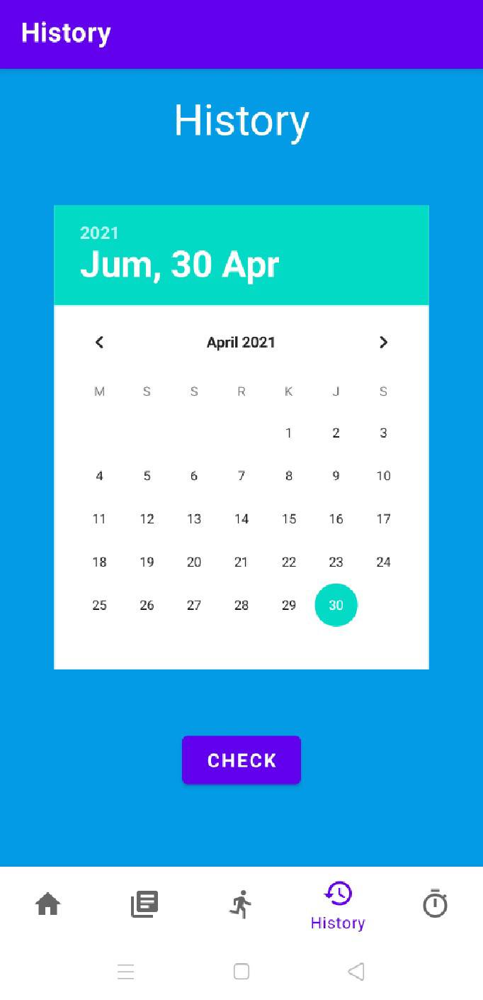
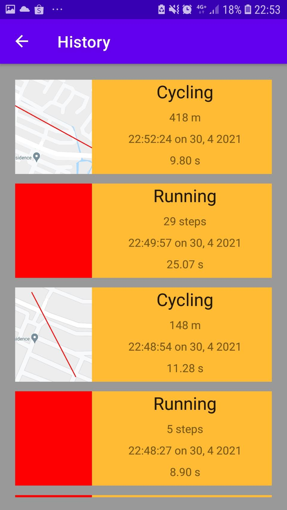
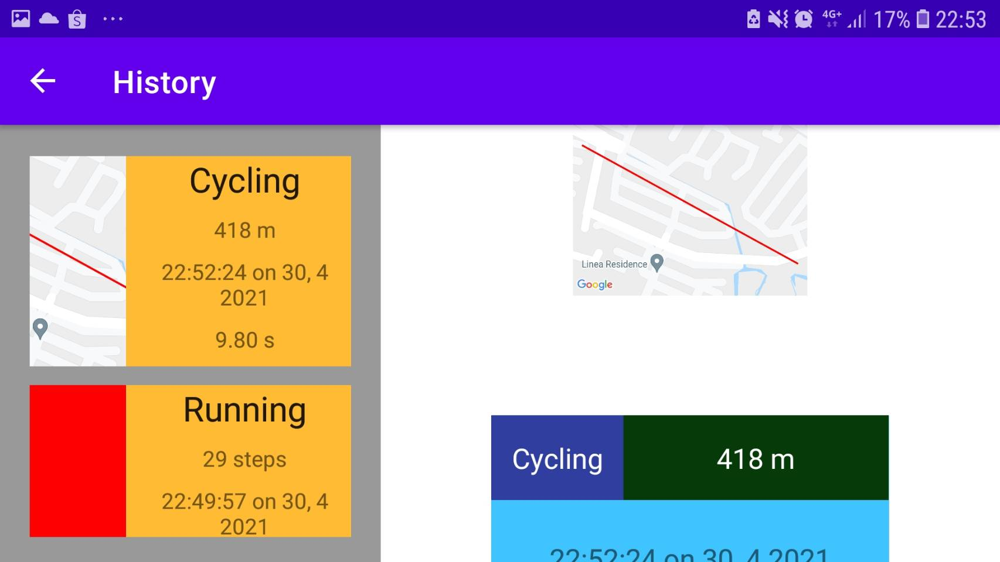
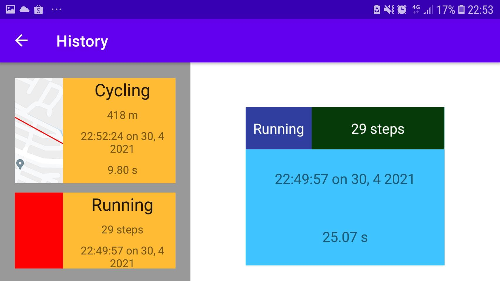
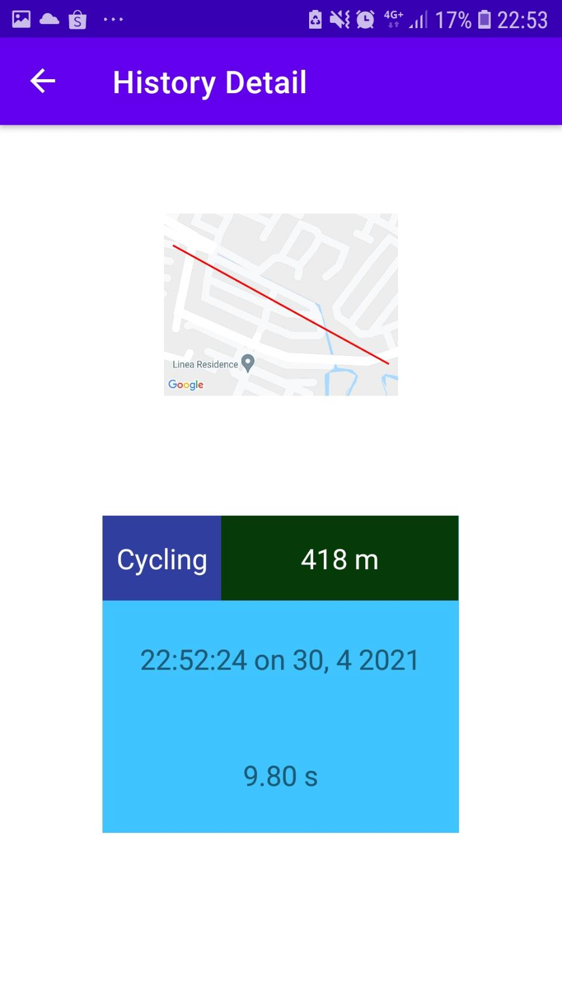
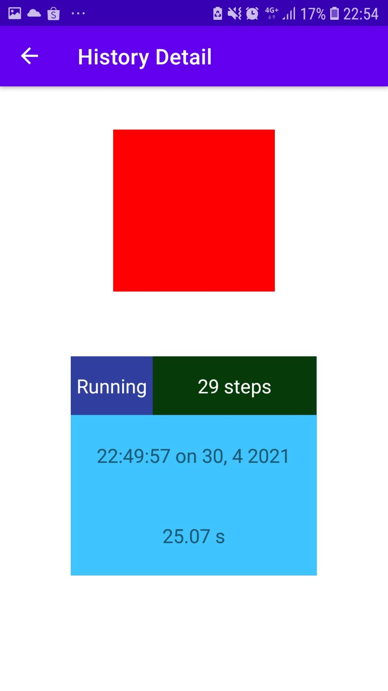

### Training Scheduler
- Aplikasi menampilkan pilihan waktu yang dapat dipilih untuk membuat jadwal

#### Documentation
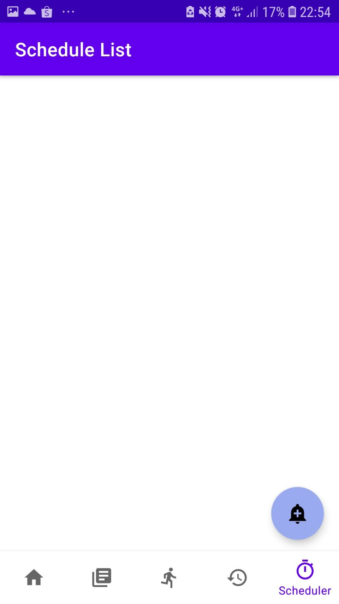
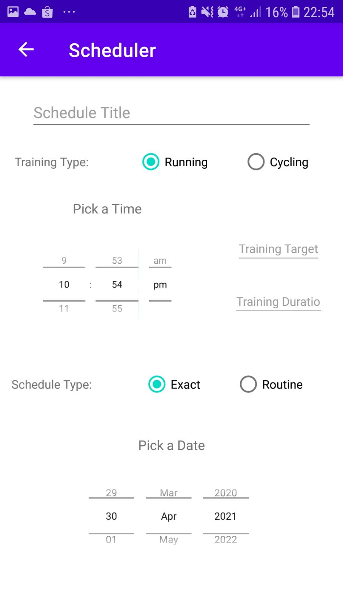

### Other Specification
- Menggunakan recyclerviewer untuk menampilkan list berita
- Menyimpan log history pada SQLite, sebagai database
- Pada fitur SportNews, ketika orientasi landscape. Berita ditampilkan dalam 2 kolom. Saat potrait dalam 1 kolom
- Jika device android dalam keadaan orientasi landscape. Ketika pengguna menekan salah satu list, detail ditampilkan disebelah kanan daftar list log history. Penerapan ini menggunakan fragment.

## Contributors
----------------
1. Naufal Prima Yoriko (13518146)
   - nmnmnm

2. Yasyfiana Fariha (13518143)
   - Calendar History
   - List history (fragment, database, recyclerviewer, bug)
   - Detail fragment (baru fragment polos)

## Credits
----------------

Here are some learning source that we're used to create this project

- [Android Developer Docs](https://developer.android.com)
- [Kotlin Lang Docs](https://kotlinlang.org/docs/home.html)
- [Raywenderlich Web](https://www.raywenderlich.com)
- [Phillip Lackner Youtube Channel](https://www.youtube.com/playlist?list=PLQkwcJG4YTCQ6emtoqSZS2FVwZR9FT3BV)
- [Simplified Programming Youtube Channel](https://www.youtube.com/watch?v=0aOn2mIRlCA)
- [Programmer World Youtube Channel](https://www.youtube.com/watch?v=Dqg1A4hy-jI)
- Android Codelabs
